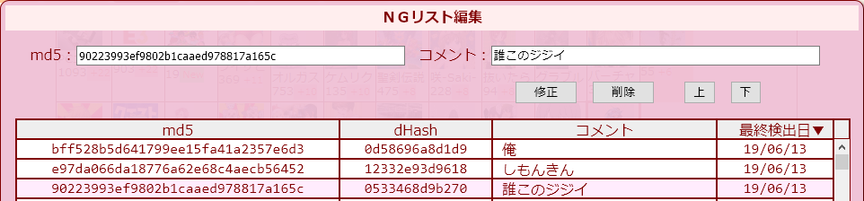

## futaba catalog NG
このUserscriptはふたば☆ちゃんねるのカタログに現在表示されているすべてのスレ本文の文字列を監視して、登録したNGワードに該当するスレを非表示にします。NGワードには正規表現が利用できます。  
また、スレのNGボタンでそのスレのみを非表示にしたり、スレ本文をNGワードに登録したり、スレ画像をNGリストに登録することもできます。  

Firefoxの場合、[Tampermonkey](https://addons.mozilla.org/ja/firefox/addon/tampermonkey/)を先にインスールしてからスクリプトをインストールして下さい。  
(GreasemonkeyやViolentmonkeyでの動作は未確認です)  
Chromeの場合、[Tampermonkey](https://chrome.google.com/webstore/detail/tampermonkey/dhdgffkkebhmkfjojejmpbldmpobfkfo/)を先にインスールしてからスクリプトをインストールして下さい。  

※このUserscriptは単体で利用可能ですが、Firefoxアドオン[KOSHIAN](https://addons.mozilla.org/ja/firefox/user/anonymous-a0bba9187b568f98732d22d51c5955a6/)（[改変版](https://github.com/akoya-tomo/futaba_auto_reloader_K/wiki/)含む）や[赤福Firefox SP](http://toshiakisp.github.io/akahuku-firefox-sp/)との併用も可能です。[ふたクロ](http://futakuro.com/)や[五平餅](https://toshiaki-gohei.github.io/gohei-mochi/)との併用では正常に動作しません。  
※その他のふたば閲覧支援ツールは[こちら](https://github.com/akoya-tomo/futaba_auto_reloader_K/wiki/)。

## 使い方
* NGワード使用時はふたばのカタログモードの設定で「文字数」を適当な大きさ(4以上推奨)に設定してください。(板毎に設定が必要です)
* NGワードの[設定]ボタンをクリックして監視したいNGワードを入力してください。
|で区切ると複数の語句を指定できます。(正規表現使用可。特殊な記号　\\*?+.^$|()[]{}　は全て正規表現のメタキャラクタとして認識されます。)  
    
NGワードは全板共通と各板個別でそれぞれ設定できます。  
* カタログのスレにマウスオーバーすると[NG]ボタンが表示されます。このボタンをクリックするとメニューが表示されます。  
    
  - 「スレNG」をクリックするとそのスレが非表示となります。  
    「スレNG」にするとカタログのタブを閉じるか、カタログ左上の[掲示板に戻る]でスレ一覧に移動するまではそのスレが非表示になります。（リロードでは解除されません）  
  - 「本文NG」をクリックするとカタログに表示されているスレ本文がNGワードの先頭に登録されます。
  - 「画像NG」をクリックするとスレ画像がNGリストの先頭に登録されます。
* NGリストの[編集]ボタンをクリックするとNG画像のリストが表示されます。コメントは自由に修正することができます。最終検出日はそのNG画像がカタログで最後に検出された日付です。  
    

## インストール
[GreasyFork](https://greasyfork.org/ja/scripts/37565-futaba-catalog-ng)　
[GitHub](https://github.com/akoya-tomo/futaba_catalog_NG/raw/master/futaba_catalog_NG.user.js)

## 設定
機能の動作はスクリプト冒頭の大文字変数をエディタで編集すれば変更することができます。  

* USE\_NG\_IMAGES : スレ画像のNG機能を有効にする（デフォルト：true）  
  - NGリストに登録されたスレ画像を非表示にする機能を有効にします。この設定値を`false`にすると画像NG機能が無効となります。  
* MAX\_NG\_THREADS : NGスレの最大保持数（デフォルト：500）  
  - 記憶可能なNGスレの最大数です。NGスレの記憶数が設定値を超えると古い順に破棄されます。  
* MAX\_OK\_IMAGES : 非NG画像名の最大保持数（板毎）（デフォルト：500）  
  - 記憶可能な非NG画像名の板毎の最大数です。画像NGの負荷を軽減するために、NGリストにマッチしなかったスレ画像名を記憶しています。この画像名の記憶数が設定値を超えると古い順に破棄されます。  
* HIDE\_CATALOG\_BEFORE\_LOAD : ページ読み込みが完了するまでカタログを隠す（デフォルト：false）  
  - ページの読込が完了するまでカタログを非表示にします。リロードしたときにNGにしたスレが一瞬表示されるのを避けたいときは`true`に設定して、Tampermonkeyのダッシュボードからfutaba catalog NGの**優先順序を1**に設定してください。  
    
  画像も含めたページの読み込みが全て完了するまではカタログが表示されませんので、スレ表示数を増やしている場合は特にご注意ください。  

## 注意事項
* [futaba thread highlighter K](https://greasyfork.org/ja/scripts/36639-futaba-thread-highlighter-k/)と併用する場合はfutaba thread highlighter K **rev16以上**をインストールして、Tampermonkeyのダッシュボードからfutaba catalog NGの**優先順序が先**になるように設定してください。  
    
* 画像NGの判定負荷が重いため、環境によってはリロード後のカタログ表示完了が非常に遅くなる可能性があります。その場合はUSE\_NG\_IMAGESを`false`に設定して画像NG機能を無効にしてください。
* 環境によっては「ページ読み込みが完了するまでカタログを隠す」を有効にしてもリロード時にカタログが一瞬表示されることがあります。

## 既知の問題
* Tampermonkeyで優先順序を先に設定していても他のUserscriptの後で実行されることがある。
  - md5変換の外部ライブラリをブラウザ起動後やスクリプト更新後に最初に読み込むときに発生することがあるようです。一度ライブラリを読み込めば次回のリロードからは優先順序に沿ってUserscriptが実行されます。

## Tips
スレ本文の文字数を増やしたらカタログが見づらくて生きるのが辛い場合  
himuro\_majika氏作のユーザースタイルシートも使ってみてください。  
[futaba\_catalog\_mod(モダンバージョン)](https://userstyles.org/styles/114129/futaba-catalog-mod-modern)  
または  
[futaba\_catalog\_mod(クラシックバージョン)](https://userstyles.org/styles/114130/futaba-catalog-mod-classic)

## ライセンス
このUserscriptにはmd5変換に[js-md5](https://github.com/emn178/js-md5/)を使用しています。

## 更新履歴
* v1.5.0 2018-09-04
  - ページのロードが完了するまでカタログを隠すオプションを追加
  - NG画像の最終検出日が更新されないことがある不具合を修正
  - コード整理
* v1.4.1 2018-07-10
  - NGボタンを[KOSHIAN カタログマーカー](https://addons.mozilla.org/ja/firefox/addon/koshian-catalog-marker/)（[改](https://github.com/akoya-tomo/koshian_catalog_marker_kai/)）のレス増加数と排他的に表示するように変更
* v1.4.0 2018-07-06
  - [futaba thread highlighter K](https://greasyfork.org/ja/scripts/36639-futaba-thread-highlighter-k/)がピックアップしたスレのNGボタンが動作するように修正
* v1.3.0 2018-04-23
  - [KOSHIAN delフォームをポップアップで開く 改](https://github.com/akoya-tomo/koshian_del_kai/)への対応
* v1.2.7 2018-03-24
  - KOSHIAN フォーム拡張アドオンと併用すると誤動作する不具合修正
  - NGリストを閉じたらNGリストのスクロール位置がトップになるように修正
* v1.2.6 2018-03-15
  - [KOSHIAN カタログの画像をポップアップで表示 改](https://github.com/akoya-tomo/koshian_image_popuper_kai/)の新機能への対応 
* v1.2.5 2018-03-10
  - カタログ以外でNGボタンが表示されてしまうことがある不具合を修正
  - 赤福でリロード後の新着スレにNGボタンが表示されない不具合を修正
* v1.2.4 2018-03-08
  - NG画像のスレが表示されてしまうことがある不具合を修正
* v1.2.3 2018-02-28
  - スレ画像のBase64変換の例外処理を追加
  - 赤福でNGボタンメニューがスレ画像に隠れる不具合を修正
* v1.2.2 2018-02-24
  - スレ画像を取得失敗したときの処理を修正
* v1.2.1 2018-02-21
  - NG操作でfutaba thread highlighter Kのピックアップに即時反映されるように変更
* v1.2.0 2018-02-07
  - 「画像NG」機能追加
  - 「本文NG」機能追加
* v1.1.0 2018-01-30
  - 「スレNG」機能追加
* v1.0.1 2018-01-18
  - futaba thread highlighter(K)使用時はスレッド検索設定とNGワード設定を同じ並びに変更
* v1.0.0 2018-01-18
  - 新規リリース
