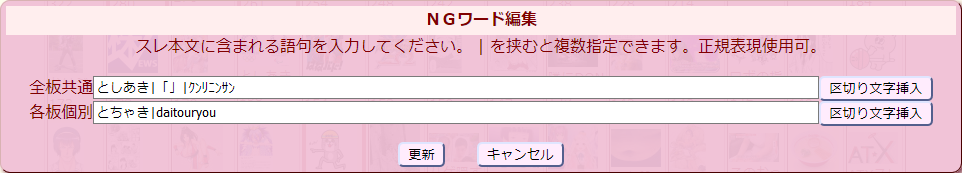
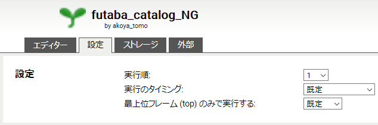

## futaba catalog NG
この Userscript はふたば☆ちゃんねるのカタログに現在表示されているすべてのスレ本文の文字列を監視して、登録したNGワードに該当するスレを非表示にします。NGワードには正規表現が利用できます。  
また、スレのNGボタンから一時的に非表示にしたり、スレ本文をNGワードに登録したり、スレ画像をNGリストに登録することもできます。  

Firefox の場合、[Tampermonkey](https://addons.mozilla.org/ja/firefox/addon/tampermonkey/) を先にインスールしてからスクリプトをインストールして下さい。  
(Greasemonkey や Violentmonkey での動作は未確認です)  
Chrome の場合、[Tampermonkey](https://chrome.google.com/webstore/detail/tampermonkey/dhdgffkkebhmkfjojejmpbldmpobfkfo/) を先にインスールしてからスクリプトをインストールして下さい。  

※この Userscript は単体で利用可能ですが、Firefoxアドオン [KOSHIAN](https://addons.mozilla.org/ja/firefox/user/anonymous-a0bba9187b568f98732d22d51c5955a6/)（[改変版](https://github.com/akoya-tomo/futaba_auto_reloader_K/wiki/)含む）や [赤福Extended・赤福Firefox SP](http://toshiakisp.github.io/akahuku-firefox-sp/) または Chromeアドオン [ふたクロ](http://futakuro.com/) との併用も可能です。[五平餅](https://toshiaki-gohei.github.io/gohei-mochi/) との併用では正常に動作しません。  
※その他のふたば閲覧支援ツールは[こちら](https://github.com/akoya-tomo/futaba_auto_reloader_K/wiki/)。

## 使い方
* NGワード使用時はふたばのカタログモードの設定で「文字数」を適当な大きさ(4以上推奨)に設定してください。(板毎に設定が必要です)
* NGワードの\[設定\]ボタンをクリックして監視したいNGワードを入力してください。
|で区切ると複数の語句を指定できます。(正規表現使用可。特殊な記号　\\*?+.^$|()[]{}　は全て正規表現のメタキャラクタとして認識されます。)  
    
NGワードは全板共通と各板個別でそれぞれ設定できます。  
* カタログのスレにマウスオーバーすると\[NG\]ボタンが表示されます。このボタンをクリックするとメニューが表示されます。  
    
  - 「スレNG」をクリックするとそのスレが一時的に非表示となります。  
    「スレNG」にするとカタログのタブを閉じるか、スレNG\[クリア\]ボタンでクリアするまではそのスレが非表示になります。（リロードでは解除されません）  
  - 「本文NG」をクリックするとカタログに表示されているスレ本文がNGワードの先頭に登録されます。
  - 「画像NG」をクリックするとスレ画像がNGリストの先頭に登録されます。
* NGリストの\[編集\]ボタンをクリックするとNG画像のリストが表示されます。コメントは自由に修正することができます。最終検出日はそのNG画像がカタログで最後に検出された日付です。  
    
  - NGリストを修正後に\[更新\]ボタンで修正が反映されます。\[キャンセル\]ボタンで修正を破棄することができます。  
  - NGリスト内の選択行を上下ボタンで自由に並び替えることができます。  
  - NGリストの項目欄をクリックでソートできます。項目欄をクリックするたびに昇順と降順が切り替わります。  

## インストール
[GreasyFork](https://greasyfork.org/ja/scripts/37565-futaba-catalog-ng)　
[GitHub](https://github.com/akoya-tomo/futaba_catalog_NG/raw/master/futaba_catalog_NG.user.js)

## 設定
機能の動作はスクリプト冒頭の大文字変数をエディタで編集すれば変更することができます。  

* USE\_NG\_IMAGES : スレ画像のNG機能を有効にする（デフォルト：true）  
  - NGリストに登録されたスレ画像を非表示にする機能を有効にします。この設定値を `false` にすると画像NG機能が無効となります。  
* MAX\_NG\_THREADS : NGスレの最大保持数（デフォルト：500）  
  - 記憶可能なNGスレの最大数です。NGスレの記憶数が設定値を超えると古い順に破棄されます。  
* MAX\_OK\_IMAGES : 非NG画像名の最大保持数（板毎）（デフォルト：500）  
  - 記憶可能な非NG画像名の板毎の最大数です。画像NGの負荷を軽減するために、NGリストにマッチしなかったスレ画像名を記憶しています。この画像名の記憶数が設定値を超えると古い順に破棄されます。  
* HIDE\_CATALOG\_BEFORE\_LOAD : ページ読み込みが完了するまでカタログを隠す（デフォルト：false）  
  - ページの読込が完了するまでカタログを非表示にします。リロードしたときにNGにしたスレが一瞬表示されるのを避けたいときは `true` に設定して、Tampermonkey のダッシュボードから futaba catalog NG の**実行順を1**に設定してください。  
    
  画像も含めたページの読み込みが全て完了するまではカタログが表示されませんので、スレ表示数を増やしている場合は表示されるのが遅くなる場合があります。  
* USE\_NG\_THREAD\_CLEAR\_BUTTON : スレNG\[クリア\]ボタンを使用する（デフォルト：false）  
  - スレNGをクリアするボタンを表示します。クリアボタンを押すとその板で登録したスレNGが全てクリアされます。  
      

    `false` に設定していても Tampermonkey のツールバーボタンのメニューにある「スレNGクリア」で同じ操作ができます。  
      
* USE\_DHASH : 近似画像NGを使用する（デフォルト：false）
  - NG画像に近似するスレ画像を非表示にします。
* DISTANCE_THRESHOLD : NG判定する画像の近似度（デフォルト：3）
  - 近似度（ハミング距離）は0〜49の値を取り、値が小さいほど画像の近似度が高くなります。  
    近似度が0で画像のdHash値が完全に一致、1〜2でほぼ同じ画像、3〜4で近似画像の可能性が高いが稀に誤検出、5〜7で近似画像の可能性が有るが誤検出も多いといった感じです。  
* ENABLE_DHASH_TEST : 近似画像NGのテストモードを有効にする。（デフォルト：false）
  - 近似画像NGにしたスレを隠さずにスレ画像を透過して、スレの背景色を変えます。スレ画像にマウスを乗せると透過が解除されます。開発ツール\(Ctrl + Shift + I\)のコンソールで近似画像NG判定した画像のdHash値と近似度が確認できます。`DISTANCE_THRESHOLD` の調整にご利用ください。

## 注意事項
* [futaba thread highlighter K](https://greasyfork.org/ja/scripts/36639-futaba-thread-highlighter-k/) と併用する場合は futaba thread highlighter K **rev17以上**をインストールして、Tampermonkey のダッシュボードから futaba catalog NG の**実行順が先**になるように設定してください。  
    
* 画像NGの判定負荷が重いため、環境によってはリロード後のカタログ表示完了が非常に遅くなる可能性があります。その場合は USE\_NG\_IMAGES を `false` に設定して画像NG機能を無効にしてください。
* 環境によっては「ページ読み込みが完了するまでカタログを隠す」を有効にしてもリロード時にカタログが一瞬表示されることがあります。
* カタログのスレ画像サイズが1~5の状態でv1.6.1以前にNG登録した画像はv1.6.2以降でも画像の一部分だけでNG判定されます。誤判定などの問題があるときはNGリストから一度削除してから再登録することで問題を解消できます。
* ふたクロのNG機能と併用できますが\[NG\]ボタンは futaba catalog NG の物が表示されます。

## 既知の問題
* Tampermonkey で優先順序を先に設定していても他の Userscript の後で実行されることがある。
  - md5変換の外部ライブラリをブラウザ起動後やスクリプト更新後に最初に読み込むときに発生することがあるようです。一度ライブラリを読み込めば次回のリロードからは優先順序に沿って Userscript が実行されます。
* Waterfox でNGリストのメニューの表示が崩れる
  - 赤福Firefox sp の「レス一般→デフォルトのスタイルを無視する」のチェックを外してください。

## Tips
* スレ本文の文字数を増やしたらカタログが見づらくて生きるのが辛い  
  スレ本文のサイズを制限してマウスオーバーでポップアップ表示ができるhimuro\_majika氏作のユーザースタイルシートを試してみてください。  
  - [futaba\_catalog\_mod(モダンバージョン)](https://userstyles.org/styles/114129/futaba-catalog-mod-modern)  
    または  
  - [futaba\_catalog\_mod(クラシックバージョン)](https://userstyles.org/styles/114130/futaba-catalog-mod-classic)  
* NGリストをバックアップしたい  
  Tampermonkey のダッシュボードを開いて
  - 「ユーティリティ」タブから「スクリプトのストレージを含める」にチェックしてエクスポートする。  
    （インストールしている全てのスクリプトとデータを一括保存）  
    または
  - 「インストール済み UserScript」タブから futaba catalog NG を選択して「ストレージ」タブのテキストエリア内の文字を全選択してコピーし、テキストエディタに貼り付けてUTF-8で保存する。  
    （NGデータだけを保存）  
* 近似画像NG機能について  
  近似画像NGは「見た目は同じだけどファイルとしては異なる」画像を近似画像としてNGにする機能です。  
  見た目は似ているけど違いが判別できる画像は基本的に近似画像と判定されないのでご注意ください。  
  v1.7.0以降に登録されたNG画像とv1.7.2以降にカタログで検出されたNG画像のみ近似画像NG判定されます。  
  （NGリストでdHashがあるNG画像です）  

  以下は近似画像として判定されないケースです。  
  - トリミングされた画像
  - 回転・反転した画像
  - 別の画像と繋げた画像
  - 背景だけが同じ画像

  逆にバストアップなど構図が同じ画像は誤検出する可能性があります。  

## ライセンス
* この Userscript には md5 変換に [js-md5](https://github.com/emn178/js-md5/) を使用しています。
* 近似画像判定に使用しているdHashの計算は以下のブログに記載されている方法をベースにしています。  
  [THE HACKER FACTOR BLOG](http://www.hackerfactor.com/blog/index.php?/archives/529-Kind-of-Like-That.html)

## 更新履歴
* v1.9.1 2020-03-03
  - \[NG\]ボタンとスレのプルダウンメニューボタンが重ならないように修正
  - v1.8.0で暫定対応した新レイアウトのカタログのコードを削除
* v1.9.0 2019-12-25
  - スレのプルダウンメニュー付カタログでNGボタンメニューの表示位置がずれる不具合を修正
* v1.8.0 2019-11-11
  - 新レイアウトのカタログに暫定対応
* v1.7.5 2019-09-20
  - 近似画像NGの閾値のデフォルトを 4 → 3 に変更
  - 軽微な不具合を修正
* v1.7.4 2019-08-13
  - NGリスト編集時にホイールリロードが抑止できない不具合を修正
  - テストモードで近似画像NGになったスレのスタイルを変更
* v1.7.3 2019-07-02
  - NGリスト編集時に上下キーで前後の行に選択が移るように修正
  - NGリスト編集時にF2キーでコメント編集欄にフォーカスが移動するように修正
  - NGワード編集を閉じたときにNGワード入力欄のカーソルを先頭に戻すように修正
  - リロードの監視を修正
* v1.7.2 2019-06-27
  - カタログから検出したNG画像にdHashが無かったらdHashを登録するように修正
  - 近似画像NGのテストモードで検出した画像のマークを修正
* v1.7.1 2019-06-24
  - 近似画像NGが無効でもNG画像登録で常にdHashを登録するように修正
  - 近似画像NGの閾値のデフォルトを 7 → 4 に変更
  - 近似画像NGのテストモードでdHashを常に13桁で表示するように修正
  - NG判定対象条件を修正
* v1.7.0 2019-06-13
  - 近似画像NG機能を追加
  - ふたクロで動作するように修正
* v1.6.6 2019-05-20
  - カタログでUNDOしたときに\[NG\]ボタンが表示されなくなる不具合を修正
  - \[NG\]ボタンのサイズを調整
* v1.6.5 2019-05-15
  - [KOSHIAN リロード拡張 改](https://github.com/akoya-tomo/koshian_reload_futaba_kai/) のカタログリロードに対応
* v1.6.4 2019-04-29
  - NGボタンメニューをdelフォームより前面に表示するように修正
* v1.6.3 2019-02-17
  - NGリストのコメント修正欄でEnterキーを押したときに修正したコメントがNGリストに反映されるように修正
* v1.6.2 2018-12-31
  - カタログのスレ画像サイズが1~5のときに画像の一部分だけでNG判定していた不具合を修正
  - スレ画像のdataURI変換の例外処理を修正
  - NGボタンメニューの表示位置を微調整
* v1.6.1 2018-12-06
  - NGリストの選択行を上下ボタンで移動したときにスクロールが追従しない不具合を修正
* v1.6.0 2018-12-06
  - \[掲示板に戻る\]でスレNGをクリアしないように変更
  - スレNGをクリアするボタンの設定を追加
  - NGリストの選択行を上下ボタンで並び替えできる機能を追加
  - NGリストの項目欄をクリックでソートする機能を追加
  - NGリストの修正をキャンセルできる機能を追加
  - カタログを開き直した時にその板以外で登録したスレNGもクリアされてしまう不具合を修正
  - 画面を縮小表示したときにNGリスト表示が崩れる不具合を修正
* v1.5.2 2018-10-16
  - NGボタンのメニューからNGワードを登録時にエスケープが必要な文字が含まれていたらエスケープを追加するように修正
* v1.5.1 2018-09-11
  - 赤福Firefox SP・赤福Extendedのリロード検出を修正
* v1.5.0 2018-09-04
  - ページのロードが完了するまでカタログを隠すオプションを追加
  - NG画像の最終検出日が更新されないことがある不具合を修正
  - コード整理
* v1.4.1 2018-07-10
  - NGボタンを [KOSHIAN カタログマーカー](https://addons.mozilla.org/ja/firefox/addon/koshian-catalog-marker/)（[改](https://github.com/akoya-tomo/koshian_catalog_marker_kai/)）のレス増加数と排他的に表示するように変更
* v1.4.0 2018-07-06
  - [futaba thread highlighter K](https://greasyfork.org/ja/scripts/36639-futaba-thread-highlighter-k/) がピックアップしたスレのNGボタンが動作するように修正
* v1.3.0 2018-04-23
  - [KOSHIAN delフォームをポップアップで開く 改](https://github.com/akoya-tomo/koshian_del_kai/) への対応
* v1.2.7 2018-03-24
  - KOSHIAN フォーム拡張アドオンと併用すると誤動作する不具合修正
  - NGリストを閉じたらNGリストのスクロール位置がトップになるように修正
* v1.2.6 2018-03-15
  - [KOSHIAN カタログの画像をポップアップで表示 改](https://github.com/akoya-tomo/koshian_image_popuper_kai/) の新機能への対応 
* v1.2.5 2018-03-10
  - カタログ以外でNGボタンが表示されてしまうことがある不具合を修正
  - 赤福でリロード後の新着スレにNGボタンが表示されない不具合を修正
* v1.2.4 2018-03-08
  - NG画像のスレが表示されてしまうことがある不具合を修正
* v1.2.3 2018-02-28
  - スレ画像のBase64変換の例外処理を追加
  - 赤福でNGボタンメニューがスレ画像に隠れる不具合を修正
* v1.2.2 2018-02-24
  - スレ画像を取得失敗したときの処理を修正
* v1.2.1 2018-02-21
  - NG操作で futaba thread highlighter Kの ピックアップに即時反映されるように変更
* v1.2.0 2018-02-07
  - 「画像NG」機能追加
  - 「本文NG」機能追加
* v1.1.0 2018-01-30
  - 「スレNG」機能追加
* v1.0.1 2018-01-18
  - futaba thread highlighter(K) 使用時はスレッド検索設定とNGワード設定を同じ並びに変更
* v1.0.0 2018-01-18
  - 新規リリース
